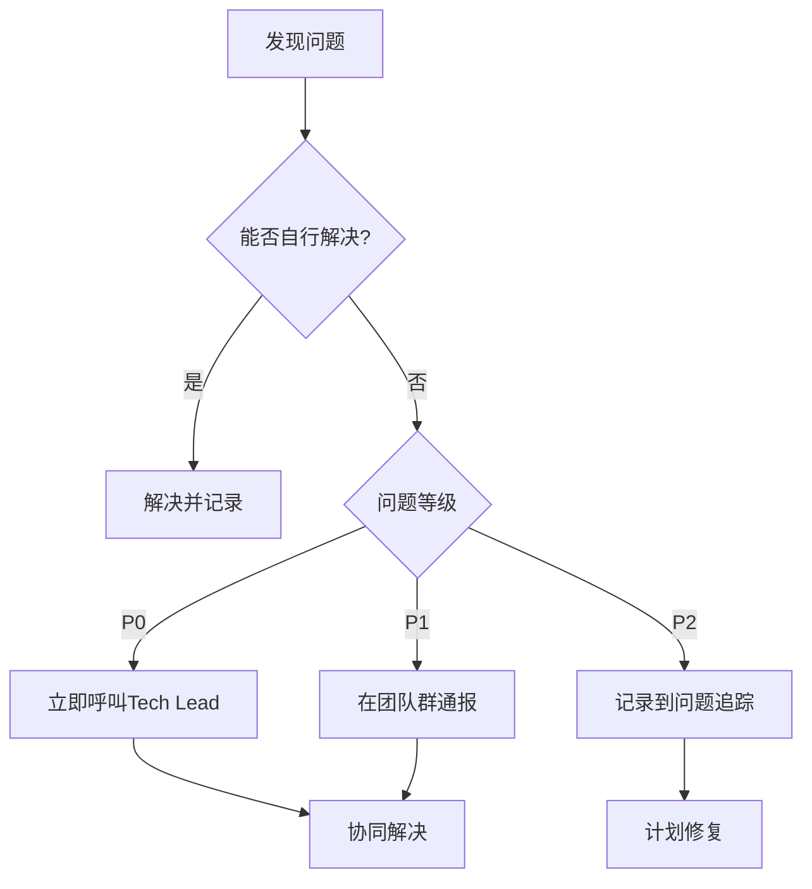

# 团队协调文档 - 阶段一并行开发

> **阶段**: 紧急修复（Phase 1）
> **工期**: 2周
> **分支**: `refactor/phase1-emergency-fixes`
> **最后更新**: 2025-03-15

---

## 👥 团队成员与分工

| 成员             | 角色     | 负责模块             | 任务文档                       |
| ---------------- | -------- | -------------------- | ------------------------------ |
| **Programmer A** | 前端开发 | Indicator模块合并    | `tasks/PROGRAMMER_A_PHASE1.md` |
| **Programmer B** | 前端开发 | API客户端 + 公共工具 | `tasks/PROGRAMMER_B_PHASE1.md` |
| **Tester/QA**    | 测试验证 | 阶段一测试与验证     | `tasks/TESTER_PHASE1.md`       |
| **Tech Lead**    | 技术指导 | 代码审查、问题解决   | -                              |

---

## 📅 并行开发时间表

### Week 1

```
┌─────────────┬─────────────────────┬─────────────────────┐
│     Day     │   Programmer A      │   Programmer B      │
├─────────────┼─────────────────────┼─────────────────────┤
│  Day 1 (Mon)│ 差异分析            │ 创建API客户端        │
│  Day 2 (Tue)│ 执行合并            │ 创建公共工具        │
│  Day 3 (Wed)│ 引用更新与测试      │ 迁移现有代码        │
│  Day 4 (Thu)│ 修复问题            │ 修复问题            │
│  Day 5 (Fri)│ 代码审查            │ 代码审查            │
└─────────────┴─────────────────────┴─────────────────────┘
```

### Week 2

```
┌─────────────┬─────────────────────┬─────────────────────┬──────────────┐
│     Day     │   Programmer A      │   Programmer B      │   Tester     │
├─────────────┼─────────────────────┼─────────────────────┼──────────────┤
│  Day 1 (Mon)│ 修复审查问题        │ 修复审查问题        │ 准备测试环境 │
│  Day 2 (Tue)│ 功能测试            │ 功能测试            │ 单元测试     │
│  Day 3 (Wed)│ 回归测试            │ 回归测试            │ 回归测试     │
│  Day 4 (Thu)│ 修复Bug             │ 修复Bug             │ 验证修复     │
│  Day 5 (Fri)│ 阶段验收            │ 阶段验收            │ 验收报告     │
└─────────────┴─────────────────────┴─────────────────────┴──────────────┘
```

---

## 🔄 协作流程

### 1. 每日站会（Daily Standup）

**时间**: 每天上午 9:30
**时长**: 15分钟
**形式**: 线上/线下

**每人报告**:

- ✅ 昨天完成了什么
- 🔄 今天计划做什么
- 🚨 遇到什么阻碍

**模板**:

```markdown
## Programmer A - 2025-03-15

### 昨天

- [x] 完成Indicator模块差异分析
- [x] 创建差异报告文档

### 今天

- [ ] 开始执行模块合并
- [ ] 合并API文件

### 阻碍

- 无 / 需要与B协调XXX
```

### 2. 代码审查流程

**触发条件**: 每个功能完成后
**审查者**: Tech Lead + 另一位程序员

**检查清单**:

- [ ] 代码符合规范
- [ ] 功能完整实现
- [ ] 测试覆盖充分
- [ ] 文档已更新
- [ ] 无明显bug

**审查命令**:

```bash
# 查看改动
git diff

# 查看提交
git log --oneline -5

# 添加审查批准
git commit --amend --signoff
```

### 3. 冲突解决

**当两个程序员修改同一文件时**:

```bash
# 1. 先拉取最新代码
git pull origin refactor/phase1-emergency-fixes

# 2. 如果有冲突
git status
# 查看 both modified 的文件

# 3. 手动解决冲突
# 编辑冲突文件，选择正确的代码

# 4. 标记冲突已解决
git add <冲突文件>

# 5. 提交
git commit -m "resolve: 解决合并冲突"
```

---

## 📋 任务依赖关系

```
┌─────────────────────┐
│ Programmer B        │
│ 创建API客户端        │
│ (Day 1)             │
└──────────┬──────────┘
           │
           ▼
┌─────────────────────┐
│ Programmer B        │
│ 迁移API文件          │
│ (Day 3)             │
└──────────┬──────────┘
           │
           ▼
┌─────────────────────┐
│ Programmer A        │
│ 删除旧API文件        │
│ (Day 3)             │
└─────────────────────┘
```

**关键依赖**:

1. **B必须在Day 1完成API客户端** → A才能在Day 3删除旧的API文件
2. **A必须在Day 3完成合并** → Tester才能开始测试

---

## 🚨 风险管理

### 风险等级定义

| 等级  | 说明                 | 响应时间 |
| ----- | -------------------- | -------- |
| 🔴 P0 | 阻塞性问题，无法继续 | 立即     |
| 🟡 P1 | 重要问题，影响功能   | 4小时内  |
| 🟢 P2 | 一般问题，可绕过     | 当天     |

### 问题上报流程



### 应急联系人

| 角色         | 姓名 | 联系方式      |
| ------------ | ---- | ------------- |
| Tech Lead    | -    | @tech-lead    |
| Programmer A | -    | @programmer-a |
| Programmer B | -    | @programmer-b |
| Tester       | -    | @tester       |

---

## 📊 进度追踪

### 每日进度报告模板

创建文件 `docs/tasks/daily-progress.md`:

```markdown
# 每日进度报告

## 2025-03-15 (Week 1, Day 1)

### Programmer A - Indicator模块

- [x] 差异分析 (100%)
- [ ] 执行合并 (0%)
- [ ] 引用更新 (0%)
- **进度**: 33%

### Programmer B - API/工具

- [x] API客户端 (100%)
- [ ] 公共工具 (50%)
- [ ] 代码迁移 (0%)
- **进度**: 50%

### 总体进度

- 阶段一: 33%
- 状态: 🟢 正常
- 风险: 无

### 明日计划

- A: 完成模块合并
- B: 完成公共工具
```

### 里程碑

| 里程碑           | 目标日期 | 验收标准                    | 状态 |
| ---------------- | -------- | --------------------------- | ---- |
| M1: 基础设施完成 | Day 1    | API客户端和工具函数创建完成 | ⏳   |
| M2: 代码迁移完成 | Day 3    | 所有重复代码已迁移          | ⏳   |
| M3: 测试通过     | Day 5    | 单元测试和回归测试通过      | ⏳   |
| M4: 阶段一验收   | Day 10   | 所有验收标准达成            | ⏳   |

---

## 📝 代码规范

### Git提交规范

```bash
# 格式
<type>(<scope>): <subject>

# 类型
feat: 新功能
fix: 修复bug
refactor: 重构
test: 测试
docs: 文档
style: 格式
chore: 构建/工具

# 示例
git commit -m "feat(api): 创建统一API客户端"
git commit -m "refactor(indicator): 合并两个indicator模块"
git commit -m "fix(utils): 修复进度计算错误"
```

### 分支命名规范

```bash
# 格式
<type>/<short-description>

# 示例
refactor/merge-indicator-modules
feat/unified-api-client
fix/progress-calculation
```

---

## 🎯 阶段验收

### 验收会议

**时间**: Week 2, Day 5
**参与者**: 全员 + Tech Lead
**议程**:

1. 代码审查结果 (15分钟)
2. 测试报告 (15分钟)
3. 功能演示 (20分钟)
4. 问题讨论 (20分钟)
5. 阶段总结 (10分钟)

### 验收清单

```markdown
## 阶段一验收清单

### 代码质量

- [ ] ESLint 0错误
- [ ] TypeScript编译无警告
- [ ] 代码审查通过

### 功能测试

- [ ] 指标模块功能正常
- [ ] API调用正常
- [ ] 工具函数工作正常

### 测试覆盖

- [ ] 单元测试通过
- [ ] 回归测试通过
- [ ] 无新增bug

### 文档

- [ ] 代码注释完整
- [ ] API文档更新
- [ ] 阶段报告完成
```

---

## 📚 相关文档

- [重构方案总览](../前端渐进式重构方案.md)
- [Programmer A任务卡](./PROGRAMMER_A_PHASE1.md)
- [Programmer B任务卡](./PROGRAMMER_B_PHASE1.md)
- [Tester任务卡](./TESTER_PHASE1.md)

---

**文档维护**: Tech Lead
**最后更新**: 2025-03-15
